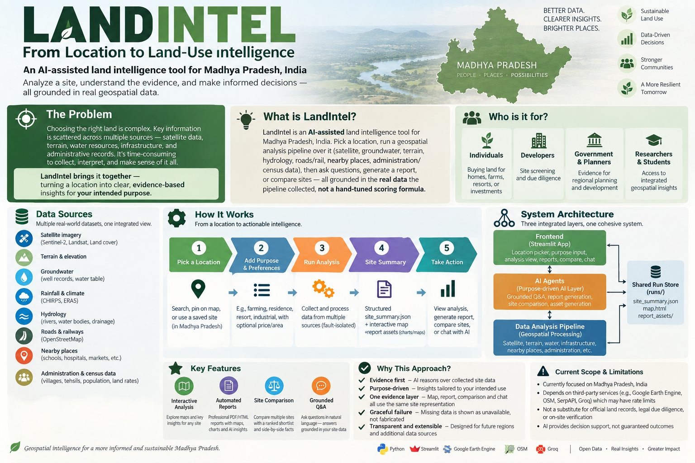

# LandIntel

An AI-assisted land intelligence tool for Madhya Pradesh, India: pick a
location, run a geospatial analysis pipeline over it (satellite, groundwater,
terrain, hydrology, roads/rail, nearby places, administration/census data),
then ask questions, generate a report, or compare sites — all grounded in the
real data the pipeline collected, not a hand-tuned scoring formula. 




## Architecture overview

```
Pick a site  →  (new site only) state purpose/preferences  →  run or load
                                                                    │
                                                                    ▼
                              site_summary.json  +  interactive Folium map
                              +  report_assets/ (pre-rendered charts/maps)
                                                                    │
                        ┌───────────────────────┬──────────────────┼──────────────────┐
                        ▼                       ▼                  ▼                  ▼
                 View Analysis           Generate Report        Compare              Chat
              (map + AI Insights)      (PDF/HTML, 1 Groq call)  (ranked shortlist)  (grounded Q&A)
```

One cohesive package, three top-level Python packages plus the shared run
store:

- **`data_analysis_pipeline/`** — the analysis pipeline: fetches and
  processes satellite imagery, groundwater, rainfall, terrain, hydrology,
  roads/rail, nearby places, and administration/census data for a given
  lat/lon (`orchestrator.run_analysis`), and assembles it into one
  `site_summary.json` per run (`assemble_summary.py`).
- **`aI_agents/`** — the purpose-driven AI layer built on top: the one
  grounded Q&A function (`qa.py`) and its tool-routing wrapper for free-form
  chat (`qa_agent.py`), report/compare HTML+PDF generation (`build_report.py`,
  `build_compare_report.py`), static report-asset (chart/map) generation
  (`report_assets.py`), and the background analysis-run worker
  (`run_worker.py`).
- **`frontend/`** — the single Streamlit app (`streamlit_app.py`): location
  picker, buying-purpose field, View Analysis/Generate Report/Compare
  dialogs, and the chat box.
- **`runs/`** — the shared run store: `site_summary.json`, `map.html`, and
  `report_assets/` per run, written by the pipeline and read by both
  `aI_agents` and `frontend`.

All three packages import each other as plain top-level packages (no path
tricks, no sibling-bootstrap hacks) — `frontend` and `aI_agents` both depend
on `data_analysis_pipeline`, and `frontend` depends on `aI_agents`, but
never the other way around.

**This is the short version** — [docs/ARCHITECTURE.md](docs/ARCHITECTURE.md)
has the full pipeline stage order, the actual step-by-step user workflow,
and a complete reference of every module and every function/class in the
codebase; [docs/DATA_SOURCES.md](docs/DATA_SOURCES.md) covers every dataset
used; [docs/REPORT_METHODOLOGY.md](docs/REPORT_METHODOLOGY.md) covers the
report's chapter-by-chapter deterministic/AI split.

## Setup instructions

1. **Create the environment**
   ```bash
   conda env create -f environment.yml
   conda activate land_intel
   ```
2. **Configure secrets — either of these two ways:**
   - **Option A — edit `.env` before running.** Copy `.env.example` to
     `.env` (in the repo root) and fill in:
     - `GROQ_API_KEY` — required for AI Insights, Q&A, and report narratives
       (free tier at [console.groq.com](https://console.groq.com)).
     - `GEE_PROJECT_ID` — a Google Earth Engine cloud project ID (satellite
       imagery, NDVI, land cover, terrain, temperature). The first pipeline
       run will prompt an `ee.Authenticate()` browser flow if no credentials
       are cached yet.
     - `SERPAPI_KEY` — optional, powers the "nearby places" category search
       (schools, hospitals, markets, etc.). Leave blank or set
       `DISABLE_SERPAPI=1` to skip it — every consumer already degrades to
       "unavailable" gracefully, and the bundled demo runs already have this
       data pre-populated.
   - **Option B — set them from inside the running app.** Skip `.env`
     entirely, run the app (step 4 below), and open the sidebar's
     **⚙️ Settings** panel: paste `GROQ_API_KEY`/`SERPAPI_KEY`/
     `GEE_PROJECT_ID` there and click **Save settings** — this writes them
     into `.env` for you (so it's really the same end state as Option A,
     just entered through the UI instead of a text editor) and takes effect
     immediately, no restart needed.
3. **Point at the reference dataset — either of these two ways:**
   - **Option A — download it yourself.** Get the reference-data zip (MP
     village/tehsil boundaries, government guideline land-rate tables,
     CHIRPS rainfall NetCDFs, groundwater well records, census data) from
     wherever it's shared with you, unzip it, and set `LAND_INTEL_DATA_DIR`
     in `.env` (or the sidebar's **Data directory** field) to point at it.
     Defaults to `data/` (in the repo root) if unset.
   - **Option B — let the app download it.** If a
     `REFERENCE_DATA_BUNDLE_URL` is already configured (in `.env`), open the
     sidebar and click **⬇️ Download reference data** — it fetches and
     extracts the zip straight into the Data directory field's location,
     with a live progress bar, and confirms the exact path once done.
   - **This step is optional** — it's only needed to run a **new** site
     analysis; browsing, generating reports for, and chatting about the 7
     bundled demo runs in `runs/` all work with zero reference data and zero
     API keys configured at all.
4. **Run the app** (from the repo root)
   ```bash
   streamlit run frontend/streamlit_app.py
   ```

## Key design decisions

The product is built in two stages. 

**Stage 1 — Data Analysis** gathers and
processes real data for a site (satellite, groundwater, terrain, hydrology,
roads/rail, nearby places, administration/census) into a structured
`site_summary.json`, an interactive Folium map, and a set of pre-rendered
static images — the only inputs the next stage ever sees, no live data
call happens past this point. 

**Stage 2 — Reasoning Agent** takes that
`site_summary.json` and a user-stated buying purpose (farming, housing,
resort, ...) and evaluates suitability with an LLM, optionally reaching for
Wikipedia, onefivenine.com, or an ad-hoc SerpApi search when the pipeline's
own data isn't enough; this one reasoning layer powers the chat Q&A, the
generated report's interpretation text, and Compare's ranked shortlist —
all under the same guardrails (never invent a figure, disclose missing
data instead of a false absence, groundwater described by its 5-year mean
rather than one potentially unrepresentative reading, no price-trend
claims). 

The pipeline itself is fault-isolated (a slow/failing data source
degrades to "unavailable," never fails the whole run); the 7 bundled demo
runs are fully browsable/reportable with zero API keys configured; and the
whole app is one cohesive package with a one-way dependency direction
(`frontend` → `aI_agents` → `data_analysis_pipeline`, no sys.path tricks).

**Full writeup:**
[docs/DESIGN_CHOICES_AND_LIMITATIONS.md](docs/DESIGN_CHOICES_AND_LIMITATIONS.md)

## Known limitations

Groq free-tier rate limits, Madhya-Pradesh-only data coverage, metered
SerpApi/Overpass third-party dependencies (both degrade gracefully rather
than failing the run), and session-only
saved-sites/chat history (no persistence layer yet). Data sources is limited and will be expanded slowly.

**Full list:**
[docs/DESIGN_CHOICES_AND_LIMITATIONS.md](docs/DESIGN_CHOICES_AND_LIMITATIONS.md)

## Try it / testability

One can exercise the whole app without any API keys configured, using
the bundled demo runs in `runs/` (betma, kishangarh, malendi, kampel,
jabalpur, balwara, manual/Budasa — all with real satellite/groundwater/
hydrology/nearby-places data and pre-generated report assets):

- **Browse a previous run** — pick any of the 7 bundled runs, view the
  interactive map + summary panel.
- **Generate a report** — click "Generate Report" on a bundled run; confirm
  the PDF/HTML assembles from the pre-generated `report_assets/` with no live
  API calls needed.
- **Ask a few questions** — open the chat box on a bundled run and ask
  something grounded in its data (e.g. "what's the groundwater depth here?"
  or "is this a good site for farming?") — requires `GROQ_API_KEY`.
- **Compare sites** — select two or more bundled runs and generate a
  narrative comparison.
- **Run a fresh analysis** — pick a new location inside Madhya Pradesh (or
  paste a lat/lon) and run the full pipeline end-to-end — requires
  `GEE_PROJECT_ID` at minimum.

## Documentation

- [docs/ARCHITECTURE.md](docs/ARCHITECTURE.md) — full architecture writeup,
  including a complete module/function reference for every file in
  `data_analysis_pipeline/`, `aI_agents/`, and `frontend/`.
- [docs/DESIGN_CHOICES_AND_LIMITATIONS.md](docs/DESIGN_CHOICES_AND_LIMITATIONS.md)
  — every key design decision with its rationale (and the real bug some of
  them were fixes for), plus the full known-limitations list.
- [docs/DATA_SOURCES.md](docs/DATA_SOURCES.md) — every dataset used, what it
  covers, and its limitations.
- [docs/REPORT_METHODOLOGY.md](docs/REPORT_METHODOLOGY.md) — the
  deterministic/AI split explained chapter by chapter.